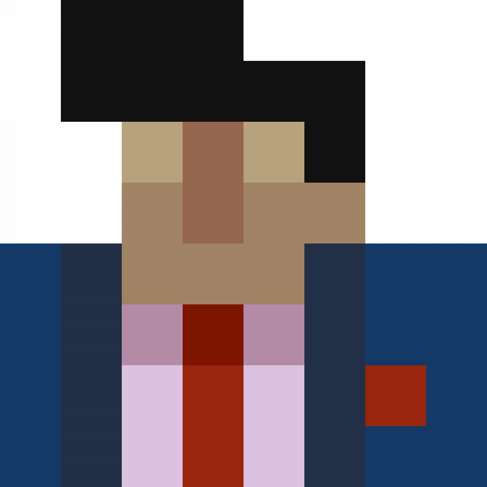

# KPal Client

Desktop client for [Krunker.io](https://krunker.io) with uncapped frame rate, matchmaking filters, custom models and Discord Rich Presence.

## Download

Get the latest version from the [releases page](https://github.com/kpal81xd/krunker-kpal-client/releases/latest):

| System         | File                                    |
| -------------- | --------------------------------------- |
| Windows        | `KPal-Client-Setup-<version>.exe`       |
| Mac            | `KPal-Client-<version>-mac.dmg`         |
| Linux (64-bit) | `KPal-Client-<version>-x86_64.AppImage` |
| Linux (32-bit) | `KPal-Client-<version>-i386.AppImage`   |

The Windows and Linux versions update themselves when you launch them. On Mac, download the new version from the releases page yourself.

## Features

Press Tab in game to open the client menu.

| Setting          | What it does                                                                                     |
| ---------------- | ------------------------------------------------------------------------------------------------ |
| URL              | The current game link. Click it to copy it.                                                      |
| Key Bind         | The key that opens this menu. Type a key and click Set.                                          |
| KPal Theme       | Turns on the dark red theme.                                                                     |
| Frame Rate Limit | Limits the frame rate to your monitor's refresh rate. Leave it off for an uncapped frame rate.   |
| Frame Rate Cap   | Caps the frame rate at a set value. 0 means no cap.                                              |
| DX9 Rendering    | Uses DirectX 9 so streaming software can capture the window (Windows).                           |
| Color Profile    | Forces a color profile, e.g. sRGB.                                                               |
| Auto-Search      | Keeps searching until a match fits your filters, and searches again when a game is full or ends. |
| Filters          | Region, mode, map and type to search for.                                                        |
| Min/Max Players  | Player count range to search for.                                                                |
| Custom Models    | Swaps game assets for files in your models folder.                                               |

Most settings apply after a restart. Use Reboot at the top of the menu to restart the client, or Reset All to go back to the defaults.

The client also shows your match in Discord Rich Presence, so friends can see what you're playing and join you.

## Keybinds

| Key    | Action                                     |
| ------ | ------------------------------------------ |
| Tab    | Open or close the client menu (changeable) |
| F3     | Search for a match using your filters      |
| F4     | Join a new match                           |
| F5     | Reload the page                            |
| F11    | Toggle fullscreen                          |
| Alt+F4 | Quit                                       |

## Custom models

1. In the client menu, turn on Custom Models.
2. Click Import and pick a folder, or type its path.
3. Inside that folder, recreate the path of each Krunker asset you want to replace. For example, a file at `textures/example.png` in your folder replaces `https://assets.krunker.io/textures/example.png`.
4. Click Reboot.

## Known issues

- The client runs on an older browser engine, and the current Krunker site may not load in it.
- Mac builds are unsigned, so macOS blocks the app the first time you open it. Go to System Settings > Privacy & Security and click Open Anyway.

## Building from source

See [CONTRIBUTING.md](CONTRIBUTING.md).
